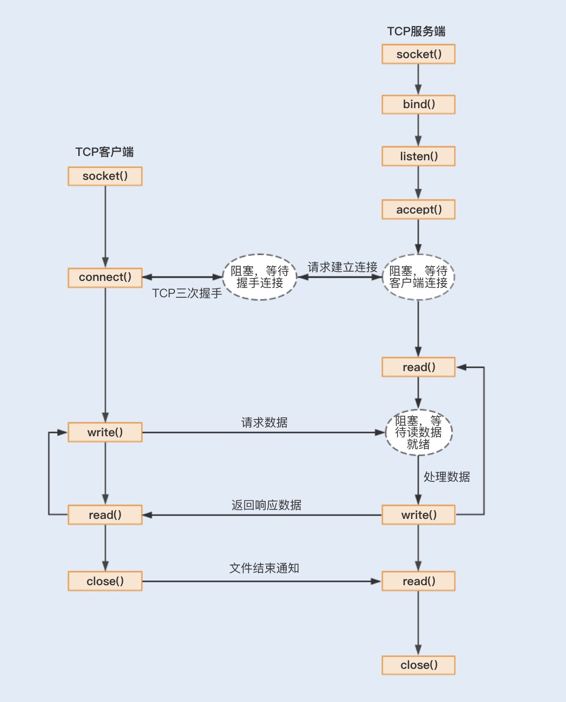

    
    
#### JDK NIO
- jdk nio的概念，既不是非阻塞io的概念，也不是io多路复用概念，它是一个库，包含很多
    - java.nio.channels.SelectableChannel#configureBlocking(boolean) 设置 非阻塞io
    - Selector io多路复用器
    - DirectByteBuffer  数据不再需要从内核空间复制到用户空间
    - Buffer缓冲区
    - Channel通道
    - FileChannel mmap
- SelectableChannel\ServerSocketChannel\SocketChannel
    ```
     * A selectable channel is either in <i>blocking</i> mode or in
     * <i>non-blocking</i> mode.  In blocking mode, every I/O operation invoked
     * upon the channel will block until it completes.  In non-blocking mode an I/O
     * operation will never block and may transfer fewer bytes than were requested
     * or possibly no bytes at all.  The blocking mode of a selectable channel may
     * be determined by invoking its {@link #isBlocking isBlocking} method.
    ```
    - A channel must be placed into non-blocking mode before being registered with a selector, and may not be returned to blocking mode until it has been deregistered.
    ```
     * <p> Newly-created selectable channels are always in blocking mode.
     * Non-blocking mode is most useful in conjunction with selector-based
     * multiplexing.  A channel must be placed into non-blocking mode before being
     * registered with a selector, and may not be returned to blocking mode until
     * it has been deregistered.
    ```
- 阻塞IO
    - Newly-created selectable channels are always in blocking mode.
    - In blocking mode, every I/O operation invoked upon the channel will block until it completes.
- 非阻塞IO    
    - 非阻塞IO要求socket被设置为NONBLOCK
    - In non-blocking mode an I/O operation will never block and may transfer fewer bytes than were requested or possibly no bytes at all
- ReadableByteChannel#read(ByteBuffer)\SocketChannel#read(ByteBuffer)
    - A read operation
    ```
     * <p> A read operation might not fill the buffer, and in fact it might not
     * read any bytes at all.  Whether or not it does so depends upon the
     * nature and state of the channel.
    ```
    - blocking mode vs non-blocking mode
    ```
        A socket channel in non-blocking mode,
     * for example, cannot read any more bytes than are immediately available
     * from the socket's input buffer; similarly, a file channel cannot read
     * any more bytes than remain in the file.  It is guaranteed, however, that
     * if a channel is in blocking mode and there is at least one byte
     * remaining in the buffer then this method will block until at least one
     * byte is read.
    ```
 
##### I/O
- 流
    - I/O是获取、交换信息的渠道，而流是完成I/O操作的主要方式。
    - 流是一种信息的转换，数据和流之间相互转化，可以看作是数据的载体，通过流实现I/O操作，实现数据的传输和交换
    - 流是一种抽象概念，它代表了数据的无结构化传递
   
    - java.io包下流
        - 字节流,InputStream、OutputStream
            - 如果是文件的读写操作，就使用FileInputStream/FileOutputStream；
            - 如果是数组的读写操作，就使用ByteArrayInputStream/ByteArrayOutputStream；
            - 如果是普通字符串的读写操作，就使用BufferedInputStream/BufferedOutputStream
            - 对象，ObjectInputStream/ObjectOutputStream
        - 字符流 Reader、Writer (字符和字节之间需要编解码，为了简易所以才有字符流)
            - 字节流转化字符流 InputStreamReader/OutputStreamWriter
            - 文件 FileReader/FileWriter
            - String StringReader/StringWriter
            - character CharArrayReader / CharArrayWriter
- I/O操作
    - 磁盘I/O操作
        - 内存和磁盘之间的数据传输
    - 网络I/O操作
        - 内存和网络之间的数据传输
    - 传统I/O操作流程
        
        1. 用户空间并通过read系统调用向内核发起读请求；
        2. 内核向硬件(硬件设备包括磁盘、网络)发送读指令，并等待读就绪；
        3. 内核把将要读取的数据复制到指向的内核缓存中；
        4. 操作系统内核将数据复制到用户空间缓冲区，然后read系统调用返回。 
    - JVM通过 FileInputStream#read()可以发起read系统调用, 且InputStream#read()是一个while循环操作，它会一直等待数据读取，直到数据就绪才会返回。 (Reads a byte of data from this input stream. This method blocks if no input is yet available.)
    - 问题
        1. 多次内存复制 数据先从外部设备复制到内核空间，再从内核空间复制到用户空间，这就发生了两次内存复制操作，引起上下文切换 用户态和内核态的相互切换
        2. 阻塞
            - 如果没有数据就绪，这个读取操作将会一直被挂起，用户线程将会处于阻塞状态
            - 大量连接请求时，就需要创建大量监听线程，这时如果线程没有数据就绪就会被挂起，然后进入阻塞状态。一旦发生线程阻塞，这些线程将会不断地抢夺CPU资源，从而导致大量的CPU上下文切换，增加系统的性能开销
    - I/O操作优化
        - 操作系统优化
            - 内核对网络I/O模型的优化-五种I/O模型
        - 语言优化
            - java NIO优化了内存复制以及阻塞导致的严重性能问题，对应零拷贝和I/O复用模型
            - NIO
                - 使用Buffer缓冲区优化读写流操作
                    - NIO, 依然是面向流的(stream-oriented ), 面向Buffer流,基于块以内存块为基本单位处理数据, Buffer是一块连续的内存块用于缓存读写数据; 传统I/O,面向流,基于流的实现以字节为单位处理数据
                    - Buffer可以将文件一次性读入内存再做后续处理，而传统的方式是边读文件边处理数据，BufferedInputStream虽然也有缓存但仍不足
                    - 通道Channel是访问缓冲的接口，用于读取缓冲或者写入数据，表示缓冲数据的源头或者目的地
                - DirectByteBuffer 优化多次内存拷贝
                    - 普通的Buffer分配的是JVM堆内存如HeapByteBuffer，而DirectByteBuffer是直接分配物理内存，可以直接访问物理内存
                    - 直接访问物理内存使数据直接在内核空间和外部设备(磁盘、网络)之间传输，减少了用户空间和内核空间之间的内存复制，减少了数据的拷贝
                    
                    - DirectBuffer申请的是非JVM的物理内存，所以创建和销毁的代价很高。DirectBuffer申请的内存并不是直接由JVM负责垃圾回收，但在DirectBuffer包装类被回收时，会通过Java Reference机制来释放该内存块
                - 通道（Channel）和 多路复用器（Selector） 优化阻塞
                    - NIO很多人也称之为Non-block I/O，即非阻塞I/O，因为这样叫，更能体现它的特点
                    - 传统的I/O对Socket的输入流进行读取时，读取流会一直阻塞，直到发生以下三种情况的任意一种才会解除阻塞
                        1. 有数据可读；
                        2. 连接释放；
                        3. 空指针或I/O异常。
                    - 通道（Channel）
                        - 读取和写入数据都要通过Channel，由于Channel是双向的，所以读、写可以同时进行
                        - 传统I/O的数据读取和写入是从用户空间到内核空间来回复制，而内核空间的数据是通过操作系统层面的I/O接口从磁盘读取或写入; 最开始，在应用程序调用操作系统I/O接口时，是由CPU完成分配，这种方式最大的问题是“发生大量I/O请求时，非常消耗CPU“；之后，操作系统引入了DMA（直接存储器存储），内核空间与磁盘之间的存取完全由DMA负责，但有些情况下会总线冲突
                        - 在实现DMA传输时，是由DMA控制器直接掌管总线，因此，存在着一个总线控制权转移问题。即DMA传输前，CPU要把总线控制权交给DMA控制器，而在结束DMA传输后，DMA控制器应立即把总线控制权再交回给CPU。一个完整的DMA传输过程必须经过DMA请求、DMA响应、DMA传输、DMA结束4个步骤；在DMA连续传输过程中，CPU可以正常工作，CPU一定以某种方式获得了总线的控制权。CPU和DMA时分复用了总线
                        - 通道的出现解决了以上问题，Channel有自己的处理器，可以完成内核空间和磁盘之间的I/O操作，
                    - 多路复用器（Selector）
                        - NIO使用I/O复用器Selector实现非阻塞I/O，Selector就是使用了这五种类型中的I/O复用模型。Java中的Selector其实就是select/poll/epoll的外包类
                        - TCP通信流程中，Socket通信中的connect、accept、read以及write为阻塞操作，在Selector中分别对应SelectionKey的四个监听事件OP_ACCEPT、OP_CONNECT、OP_READ以及OP_WRITE。
                        - 通过Selector来轮询注册在其上的Channel，当发现一个或多个Channel处于就绪状态时，返回就绪的监听事件，最后程序匹配到监听事件，进行相关的I/O操作
                        - 在创建Selector时，程序会根据操作系统版本选择使用哪种I/O复用函数。在JDK1.5版本中，如果程序运行在Linux操作系统，且内核版本在2.6以上，NIO中会选择epoll来替代传统的select/poll，这也极大地提升了NIO通信的性能
                        
                        - Selector是Java NIO编程的基础。用于检查一个或多个NIO Channel的状态是否处于可读、可写。
                        - Selector是基于事件驱动实现的，我们可以在Selector中注册accpet、read监听事件，Selector会不断轮询注册在其上的Channel，如果某个Channel上面发生监听事件，这个Channel就处于就绪状态，然后进行I/O操作。
                        - 一个线程使用一个Selector，通过轮询的方式，可以监听多个Channel上的事件。
                        - 我们可以在注册Channel时设置该通道为非阻塞，当Channel上没有I/O操作时，该线程就不会一直等待了，而是会不断轮询所有Channel，从而避免发生阻塞
                        - 目前操作系统的I/O多路复用机制都使用了epoll，相比传统的select机制，epoll没有最大连接句柄1024的限制。所以Selector在理论上可以轮询成千上万的客户端。
                    - NIO适用于发生大量I/O连接请求的场景
                    - 来源网络待确认 (在Linux中，AIO并未真正使用操作系统所提供的异步I/O，它仍然使用poll或epoll，并将API封装为异步I/O的样子，但是其本质仍然是同步非阻塞I/O，加上第三方产品的出现，Java网络编程明显落后，所以没有成为主流)
        - 用户层线程模型优化
            - NIO是基于事件驱动模型来实现的I/O操作。Reactor模型是同步I/O事件处理的一种常见模型。Reactor线程模型优化。
##### 网络I/O模型(操作系统内核)
- TCP客户端服务端的工作流程( )
    1. 首先，应用程序通过系统调用socket创建一个套接字，它是系统分配给应用程序的一个文件描述符；
    2. 其次，应用程序会通过系统调用bind，绑定地址和端口号，给套接字命名一个名称；
    3. 然后，系统会调用listen创建一个队列用于存放客户端进来的连接；
    4. 最后，应用服务会通过系统调用accept来监听接受客户端的连接请求。
    5. 当有一个客户端连接到服务端之后，服务端就会调用fork创建一个子进程，通过系统调用read监听客户端发来的消息，再通过write向客户端返回信息。

- 五种I/O模型 每一种I/O模型的出现，都是基于前一种I/O模型的优化升级。
- 网络的两个阶段 第一阶段：硬件接口到内核态 第二阶段：内核态到用户态
- 阻塞 IO和非阻塞 IO
    - 等待内核空间数据准备好则是阻塞的
    - 从硬件到内核态这一阶段，是否发生阻塞等待，可以将网络分为阻塞 IO和非阻塞 IO。如果用户发起了读写请求，但内核态数据还未准备就绪，该阶段不会阻塞用户操作，内核立马返回，则称为非阻塞 IO。如果该阶段一直阻塞用户操作。直到内核态数据准备就绪，才返回。这种方式称为阻塞 IO
- 同步 IO 和异步 IO
    - 等待从内核缓冲区读取数据到用户地址空间缓存区则是同步的
    - 数据的传递需要两个阶段，在此处只要任何一个阶段会阻塞用户请求，都将其称为同步 IO，两个阶段都不阻塞，则称为异步 IO
1. 同步阻塞式I/O
    - 在整个socket通信工作流程中，socket的默认状态是阻塞的，当不能立即完成的套接字调用时，其进程将被阻塞，被系统挂起，进入睡眠状态，一直等待相应的操作响应
    - 阻塞的地方
        - connect阻塞，直到确认连接，TCP连接的建立需要完成三次握手过程
        - accept阻塞，服务端接收外来连接，会调用accept函数，如果没有新的连接到达，调用进程将被挂起，进入阻塞状态
        - read、write阻塞，调用read函数等待客户端的数据写入，如果没有数据写入，调用子进程将被挂起，进入阻塞状态
2. 同步非阻塞式I/O
    - 使用fcntl可以把以上三种操作都设置为非阻塞操作，如果没有数据返回，就会直接返回一个EWOULDBLOCK或EAGAIN错误，此时进程就不会一直被阻塞
    - 需要设置一个线程对该操作进行轮询检查，这也是最传统的非阻塞I/O模型。
    - 用户线程轮询查看每一个I/O操作的状态，在大量请求的情况下，会大量消耗CPU
    - 需要去一个个遍历所有的IO连接，是否有新的事件产生，在高并发时场景下，效率低下
3. I/O多路复用
    - 很多人都说，IO 多路复用是用一个线程来管理多个网络连接，但本人不太认可，因为在非阻塞 IO 时，就已经可以实现一个线程处理多个网络连接了，这个是由于其非阻塞而决定的
        - 多路复用主要复用的是通过有限次的系统调用来实现管理多个网络连接。最简单来说，我目前有 10 个连接，我可以通过一次系统调用将这 10 个连接都丢给内核，让内核告诉我，哪些连接上面数据准备好了，然后我再去读取每个就绪的连接上的数据。因此，IO 多路复用，复用的是系统调用(如epoll)。通过有限次系统调用判断海量连接是否数据准备好了
    - 本质上为了解决需要遍历所有的IO连接，是否有新的事件产生，在高并发时场景下，效率低下的问题，但检查感兴趣的事件状态变化的线程依然是阻塞的，即Selector#select() 是阻塞的
    - 在I/O复用模型中，执行读写I/O操作依然是阻塞的，在执行读写I/O操作时，存在着多次内存拷贝和上下文切换，给系统增加了性能开销
    - Linux提供了I/O复用函数select/poll/epoll，进程将一个或多个读操作通过该系统调用函数，阻塞在该函数操作上，系统内核就可以帮我们侦测多个读操作是否处于就绪状态。
    - select()函数
        - 调用后select() 函数会阻塞，在超时时间内，监听用户感兴趣的文件描述符上的可读可写和异常事件的发生，直到有描述符就绪或者超时，函数返回。返回就绪的文件描述符集合
        - select() 函数监视的文件描述符分3类，分别是writefds（写文件描述符）、readfds（读文件描述符）以及exceptfds（异常事件文件描述符）
        - 通过数组存放文件描述符 且默认1024个 轮训顺序扫描fd是否就绪
        - 包含大量文件描述符的数组被整体复制到用户态和内核的地址空间之间，而无论这些文件描述符是否就绪，他们的开销都会随着文件描述符数量的增加而线性增大
        - Socket数量限制:该模式可操作的Socket数由FD_SETSIZE决定,内核默认32*32=1024.
        - 会出现频繁的将海量 fd 集合从用户态传递到内核态，再从内核态拷贝到用户态
    - poll()函数
        - 没有最大文件描述符数量的限制，Socket数量几乎无限制:
        - 依然是通过遍历FD_SETSIZE(1024)个Socket来完成调度,不管哪个Socket是活跃的,都遍历一遍.
        - 会出现频繁的将海量 fd 集合从用户态传递到内核态，再从内核态拷贝到用户态
    - epoll()函数
        - 红黑树存放文件描述符
        - 没有最大文件描述符数量1024的限制
        - 事件驱动的方式代替轮询扫描fd，基于内核提供的反射模式,有活跃Socket时,内核访问该Socket的callback,不需要遍历轮询
        - 一开始就在内核态分配了一段空间，不会出现频繁的将海量 fd 集合从用户态传递到内核态，再从内核态拷贝到用户态
        - ET 模式在很大程度上减少了 epoll 事件被重复触发的次数，因此效率要比 LT 模式高
    - 程序注册一组socket文件描述符给操作系统，监视这些fd是否有IO事件发生，有了就告诉程序处理
    - IO多路复用，I/O就是指的我们网络I/O,多路指多个TCP连接(或多个Channel)，复用指复用一个或少量线程。串起来理解就是很多个网络I/O复用一个或少量的线程来处理这些连接
    - I/O多路复用 + (堆外)直接内存 + 一个主线程阻塞检查感兴趣的事件状态是否变更 是否就可以媲美异步I/O了
4. 信号驱动式I/O
    - 解决了检查感兴趣的事件状态变化的线程依然是阻塞着的问题，信号驱动式I/O虽然在等待数据就绪时，没有阻塞进程，但在被通知后进行的I/O操作还是阻塞的，进程会等待数据从内核空间复制到用户空间中
    - 信号驱动式I/O相比于前三种I/O模式，实现了在等待数据就绪时，进程不被阻塞，主循环可以继续工作，所以性能更佳
    - 信号驱动式I/O虽然在等待数据就绪时，没有阻塞进程，但在被通知后进行的I/O操作还是阻塞的，进程会等待数据从内核空间复制到用户空间中
    - 用户进程不阻塞继续工作，内核数据就绪时，内核就为该进程生成一个SIGIO信号，通过信号回调通知进程进行相关I/O操作。
    - 而由于TCP来说，信号驱动式I/O几乎没有被使用，这是因为SIGIO信号是一种Unix信号，信号没有附加信息，如果一个信号源有多种产生信号的原因，信号接收者就无法确定究竟发生了什么。而 TCP socket生产的信号事件有七种之多，这样应用程序收到 SIGIO，根本无从区分处理
    - 信号驱动式I/O现在被用在了UDP通信
    - UDP只有一个数据请求事件，这也就意味着在正常情况下UDP进程只要捕获SIGIO信号，就调用recvfrom读取到达的数据报。如果出现异常，就返回一个异常错误
5. 异步I/O
    - 即经典的Proactor设计模式，也称为异步非阻塞IO
    - 等待数据就绪时 和 数据从内核空间复制到用户空间中 都不阻塞
    - 当用户进程发起一个I/O请求操作，系统会告知内核启动某个操作，并让内核在整个操作完成后通知进程。这个操作包括等待数据就绪和数据从内核复制到用户空间
    - 异步I/O的操作系统比较少见（目前Linux暂不支持，而Windows已经实现了异步I/O），所以在实际生产环境中很少用到异步I/O模型。
    - (节省了NIO中select函数遍历事件通知队列的代价(红黑树遍历)??? 不确定)
    
- 由于信号驱动式I/O对TCP通信的不支持，以及异步I/O在Linux操作系统内核中的应用还不大成熟，大部分框架都还是基于I/O复用模型实现的网络通信。

##### 零拷贝
- 零拷贝是一种避免多次内存复制的技术，用来优化读写I/O操作。
- 网络编程中，通常由read、write来完成一次I/O读写操作。每一次I/O读写操作都需要完成四次内存拷贝，路径是I/O设备->内核空间->用户空间->内核空间->其它I/O设备。
- 避免了内核空间与用户空间的数据交换
    - 实现用户空间和内核空间共享一个缓存数据，
    - 用户空间的一块地址和内核空间的一块地址同时映射到相同的一块物理内存地址，不管是用户空间还是内核空间都是虚拟地址，最终要通过地址映射映射到物理内存地址。
- 具体实现
    1. I/O复用中的epoll函数中就是使用了mmap减少了内存拷贝。Linux内核中的mmap函数可以代替read、write的I/O读写操作，实现用户空间和内核空间共享一个缓存数据
    2. Java的NIO编程中，使用DirectByteBuffer来实现内存的零拷贝。Java直接在JVM内存空间之外开辟了一个物理内存空间，这样内核和用户进程都能共享一份缓存数据 
    
##### 线程模型
- Reactor模型
    - NIO是基于事件驱动模型来实现的I/O操作，Reactor模型是同步I/O事件处理的一种常见模型，其核心思想是将I/O事件注册到多路复用器上，一旦有I/O事件触发，多路复用器就会将事件分发到事件处理器中，执行就绪的I/O事件操作
    - 三个主要组件
        1. 事件接收器Acceptor：主要负责接收请求连接；
        2. 事件分离器Reactor：接收请求后，会将建立的连接注册到分离器中，依赖于循环监听多路复用器Selector，一旦监听到事件，就会将事件dispatch到事件处理器；
        3. 事件处理器Handlers：事件处理器主要是完成相关的事件处理，比如读写I/O操作。
        
- 三种模型
    1. 单线程Reactor线程模型
        - 所有的I/O操作都是在一个NIO线程上完成
        - 但NIO读写I/O操作时用户进程还是处于阻塞状态，这种方式在高负载、高并发的场景下会存在性能瓶颈，一个NIO线程如果同时处理上万连接的I/O操作，系统是无法支撑这种量级的请求的
    2. 多线程Reactor线程模型
        - Netty中都使用了一个Acceptor线程来监听连接请求事件
        - 当连接成功之后，会将建立的连接注册到多路复用器中，一旦监听到事件，将交给Worker线程池来负责处理
        - 大多数情况下，这种线程模型可以满足性能要求，但如果连接的客户端再上一个量级，一个Acceptor线程可能会存在性能瓶颈
    3. 主从Reactor线程模型
        - 主流通信框架中的NIO通信框架都是基于主从Reactor线程模型来实现的
        - Acceptor不再是一个单独的NIO线程，而是一个线程池
        - Acceptor接收到客户端的TCP连接请求，建立连接之后，后续的I/O操作将交给Worker I/O线程。
- 实际应用
    - netty
        - Netty中的三种线程模型对应Reactor模型三种模型
        - boss thread只有一个, 但设计成thread pool的原因
            - netty服务端开启多个端口，需要多个boss线程，此时可以使用thread pool
            - 通过线程池管理boss线程
        - 开启一个端口，即使是主从Reactor模型，其实在Netty中，bossGroup线程池最终还是只会随机选择一个线程用于处理客户端连接，与此同时，NioServerSocetChannel绑定到bossGroup的线程中，NioSocketChannel绑定到workGroup的线程中
    - Tomcat
    
### 虚拟内存
- 虚拟内存的核心原理是：为每个程序设置一段"连续"的虚拟地址空间，把这个地址空间分割成多个具有连续地址范围的页 (page)，并把这些页和物理内存做映射，在程序运行期间动态映射到物理内存
    - 当程序引用到一段在物理内存的地址空间时，由硬件立刻执行必要的映射；而当程序引用到一段不在物理内存中的地址空间时，由操作系统负责将缺失的部分装入物理内存并重新执行失败的指令
    - 虚拟地址空间按照固定大小划分成被称为页（page）的若干单元，物理内存中对应的则是页框（page frame）
- 缺页中断
    - 在 MMU 进行地址转换时，如果页表项的 "在/不在" 位是 0，则表示该页面并没有映射到真实的物理页框，则会引发一个缺页中断
    - 当进程在进行一些计算时，CPU 会请求内存中存储的数据。在这个请求过程中，CPU 发出的地址是逻辑地址（虚拟地址），然后交由 CPU 当中的 MMU 单元进行内存寻址，找到实际物理内存上的内容。若是目标虚存空间中的内存页（因为某种原因），在物理内存中没有对应的页帧，那么 CPU 就无法获取数据。这种情况下，CPU 是无法进行计算的，于是它就会报告一个缺页错误（Page Fault）。
    - 因为 CPU 无法继续进行进程请求的计算，并报告了缺页错误，用户进程必然就中断了。这样的中断称之为缺页中断。在报告 Page Fault 之后，进程会从用户态切换到系统态，交由操作系统内核的 Page Fault Handler 处理缺页错误
- 缺页错误的分类和处理
    - 基本来说，缺页错误可以分为两类：硬缺页错误（Hard Page Fault）和软缺页错误（Soft Page Fault）。这里，前者又称为主要缺页错误（Major Page Fault）；后者又称为次要缺页错误（Minor Page Fault）。当缺页中断发生后，Page Fault Handler 会判断缺页的类型，进而处理缺页错误，最终将控制权交给用户态代码
    - 若是此时物理内存里，已经有一个页帧正是此时 CPU 请求的内存页，那么这是一个软缺页错误；于是，Page Fault Hander 会指示 MMU 建立相应的页帧到页的映射关系。这一操作的实质是进程间共享内存——比如动态库（共享对象），比如 mmap 的文件
    - 若是此时物理内存中，没有相应的页帧，那么这就是一个硬缺页错误；于是 Page Fault Hander 会指示 CPU，从已经打开的磁盘文件中读取相应的内容到物理内存，而后交由 MMU 建立这份页帧到页的映射关系
        - 例如说，进程通过 mmap 系统调用，直接建立了磁盘文件和虚拟内存的映射关系。然而，在 mmap 调用之后，并不会立即从磁盘上读取这一文件。而是在实际需要文件内容时，通过 CPU 触发缺页错误，要求 Page Fault Handler 去将文件内容读入内存
        - 如果进程A和进程B都映射了虚拟内存区域C，当A第一次读取C时通过缺页从磁盘复制文件页到内存中；但当B再读C的相同页面时，虽然也会产生缺页异常，但是不再需要从磁盘中复制文件过来，而可直接使用已经保存在内存中的文件数据
    - 不难发现，软缺页错误只是在内核态里轻轻地走了一遭，而硬缺页错误则涉及到磁盘 I/O。因此，处理起来，硬缺页错误要比软缺页错误耗时长得多。这就是为什么我们要求高性能程序必须在对外提供服务时，尽可能少地发生硬缺页错误
# 计算机存储器
# 用户态和内核态
- 中断
     - java中断
        - 既然 Java 中断机制只是设置被中断线程的中断状态
        - Java 中断机制是一种协作机制，也就是说通过中断并不能直接终止另一个线程，而需要被中断的线程自己处理中断
        - Java 中断模型也是这么简单，每个线程对象里都有一个 boolean 类型的标识（不一定就要是 Thread 类的字段，实际上也的确不是，这几个方法最终都是通过 native 方法来完成的），代表着是否有中断请求（该请求可以来自所有线程，包括被中断的线程本身）。例如，当线程 t1 想中断线程 t2，只需要在线程 t1 中将线程 t2 对象的中断标识置为 true，然后线程 2 可以选择在合适的时候处理该中断请求，甚至可以不理会该请求，就像这个线程没有被中断一样
        - interrupt 方法是唯一能将中断状态设置为 true 的方法。静态方法 interrupted 会将当前线程的中断状态清除，但这个方法的命名极不直观，很容易造成误解； 线程的 _ 中断状态 _ 不受该方法的影响 isInterrupted
        - 处理
            - 如果线程调用方法可能会导致中断状态被设置(LockSupport#park)或当可能阻塞的方法声明中有抛出 InterruptedException 则暗示该方法是可中断的，如 BlockingQueue#put、BlockingQueue#take、Object#wait、Thread#sleep 等
                - 清除中断状态并抛出 InterruptedException
                - 不方便在方法上抛出 InterruptedException 传递给上层， 捕获可中断方法的 InterruptedException 并通过 Thread.currentThread.interrupt() 来重新设置中断状态
                
            